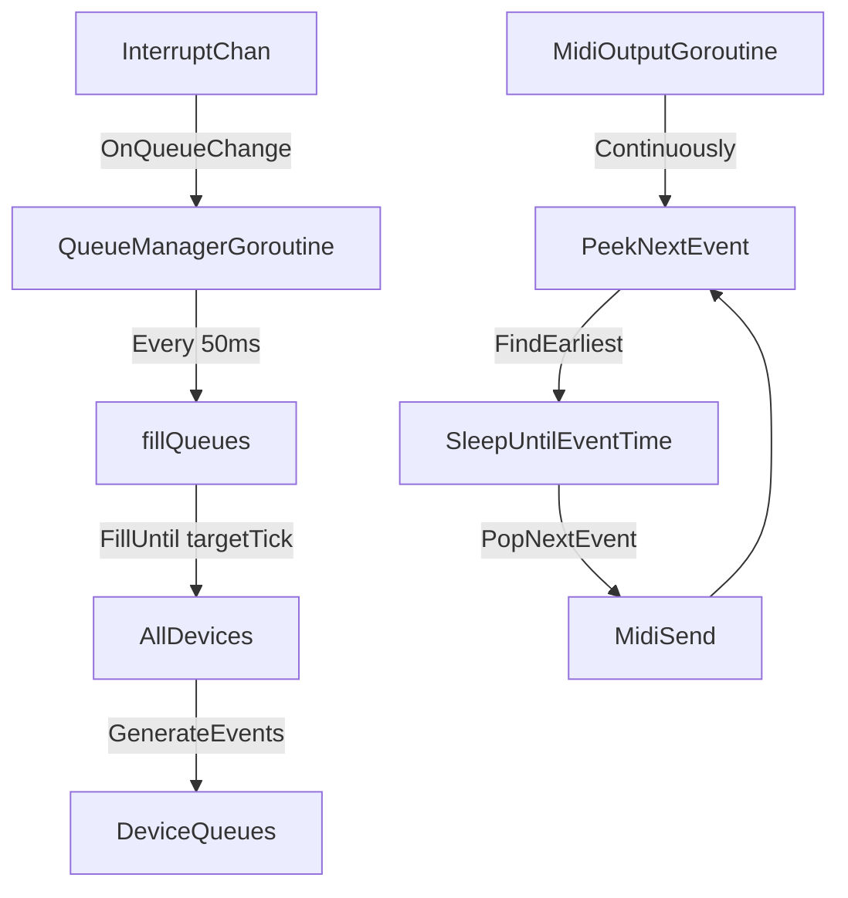
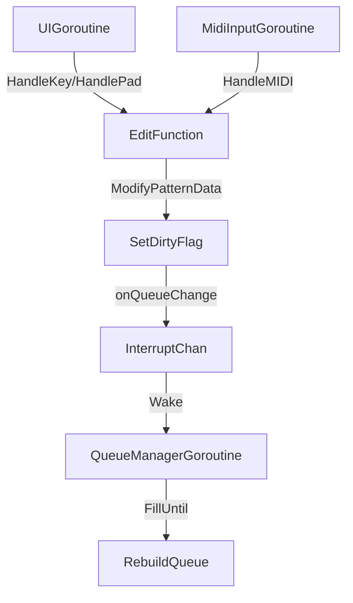

# Architecture

This document describes the **runtime architecture** of go-sequence: how time is tracked, how devices produce events, and how MIDI is dispatched.

## Goals

- **One clock**: a single authoritative mapping from wall-time → tick.
- **Queue-based playback**: devices precompute MIDI events into per-device queues.
- **Quantized pattern switching**: the Session/scene layer can request pattern changes at musically meaningful boundaries.
- **Minimal work on the hot path**: dispatch should be able to keep deadlines with a look-ahead buffer.
- **Clean separation**: 5 goroutines, each with a single clear responsibility.

## The 5 Goroutines

All runtime goroutines are started in `Manager.StartRuntime()` (called once at startup in `main.go`):

1. **UI goroutine**: `main()` → `tea.Run()` (Bubble Tea loop)
   - Handles keyboard/pad input
   - Renders TUI
   - Routes input to focused device
   - Does NOT touch queues or timing

2. **LED goroutine**: `Manager.ledLoop()`
   - Runs at fixed 30 FPS
   - Calls `focused.RenderLEDs()`, diffs vs previous state
   - Sends LED batch updates to Launchpad controller
   - Purely visual, never touches queues

3. **MIDI input goroutine**: `Manager.midiInputLoop()`
   - Consumes from `midiInputChan` (fed by keyboard controller)
   - Stamps events with current tick
   - Routes to focused device via `HandleNote()` (which does immediate echo + recording)

4. **Queue manager goroutine**: `Manager.queueManagerLoop()`
   - Runs every 50ms (periodic fill) + responds to `interruptChan` (immediate fill on queue changes)
   - Also runs UI ticker at 30 FPS (updates `S.Tick`, marks LEDs dirty, pokes TUI)
   - Calls `FillUntil(targetTick)` on all devices
   - This is the **producer** - ensures queues are filled ahead of playhead

5. **MIDI output goroutine**: `Manager.midiOutputLoop()`
   - Locked to OS thread (`runtime.LockOSThread()`)
   - Continuously scans all device queues for earliest event
   - Sleeps until event time, then `PopNextEvent()` and sends MIDI
   - This is the **consumer** - drains queues and sends to hardware

## The moving parts

- **Global state**: `S` (see `sequencer/state.go`)
  - `S.Tick`: current global tick (updated by queue manager goroutine)
  - `S.T0`: wall-clock reference at playback start (runtime only)
  - `S.TimeToTick(t)` / `S.TickToTime(tick)`: mapping between wall-time and ticks
- **Manager**: `sequencer/manager.go`
  - Owns all 5 runtime goroutines
  - Coordinates between goroutines via channels
  - Routes MIDI to multiple ports/channels
- **Devices**: implement `sequencer.Device` (see `sequencer/device.go`)
  - Maintain an internal event queue
  - Support quantized `QueuePattern(p, atTick)`
  - Handle UI input and MIDI input (recording)
  - **No goroutines** - just stateful structs called by Manager's goroutines

## Device contract (queue-based)

Devices are **producers**. The MIDI output goroutine is the **consumer**.

From `sequencer/device.go`:

- `FillUntil(tick int64)`: ensure the device's internal queue contains events up to `tick`.
- `PeekNextEvent() *midi.Event`: read the next event without removing it.
- `PopNextEvent() *midi.Event`: remove and return the next event.
- `ClearQueue()`: clear queued events (used on stop/restart).

Pattern control is *quantized*:

- `QueuePattern(p, atTick)`: request switching to pattern `p` at the next boundary after `atTick`.
  - In practice, callers pass `atTick = S.Tick` (the "now" moment when the user hit a scene/pattern).

## Runtime flow

### Playback flow

### Edit flow

## Scheduling vs queueing (inside a device)

To keep device logic clean, we separate:

- **Pattern data**: the editable notes/steps (persisted in `S.Tracks[i].Drum/Piano/etc`).
- **Schedule**: "what pattern plays when" in ticks (runtime, maintained by device).
- **Queue**: derived MIDI events ready for dispatch (runtime).

For the drum device:

- `DrumSchedule` with `StartTick` and `Patterns[]` is the source of truth.
- Queue is derived from schedule + pattern data via `syncQueueToSchedule()`.
- `patternDirty[NumPatterns]bool` tracks which patterns have been modified.
- Edit functions (ToggleStep, SetStep, etc.) only modify pattern data and set dirty flags.
- Queue manager goroutine calls `FillUntil()`, which checks dirty flags and rebuilds queue if needed.

## Concurrency rules

**Current implementation:**

- **UI goroutine**: Only edits pattern data, sets dirty flags, calls `onQueueChange()` callback.
- **MIDI input goroutine**: Routes to device `HandleMIDI()`, which edits pattern data.
- **Queue manager goroutine**: Only goroutine that calls `FillUntil()` / `syncQueueToSchedule()`.
- **MIDI output goroutine**: Only reads from queues (via `PeekNextEvent` / `PopNextEvent`).

**Why this works:**

- Edits are cheap (no queue rebuilds in UI/MIDI input paths).
- Queue rebuilds happen in one place (queue manager goroutine).
- Devices use mutexes to protect queue access (`queueMu`).
- `onQueueChange()` callback wakes queue manager via `interruptChan` when edits happen.

## Tuning: how far ahead is "enough"

`lookAheadTicks` (see `sequencer/manager.go`) is the global knob for "producer ahead of consumer".

Current value: `PPQ / 2` (~480 ticks = ~100ms at 120 BPM).

The queue manager goroutine:
- Runs every 50ms (periodic fill)
- Also responds immediately to `interruptChan` (when edits happen)
- Fills queues to `currentTick + lookAheadTicks`

The MIDI output goroutine:
- Continuously scans for earliest event
- Only sends if `S.Playing == true`
- Sleeps precisely until event time

## File map (where to look)

- `sequencer/manager.go`: All 5 goroutines, coordination, MIDI routing
- `sequencer/device.go`: Device interface contract
- `sequencer/state.go`: Global state, tick/time conversion, persisted device states
- `sequencer/drum.go`: Drum device implementation (schedule/queue approach)
- `main.go`: Calls `Manager.StartRuntime()` to start all goroutines

